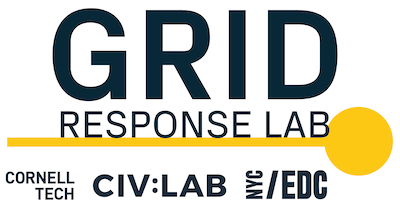

---
# You don't need to edit this file, it's empty on purpose.
# Edit theme's home layout instead if you wanna make some changes
# See: https://jekyllrb.com/docs/themes/#overriding-theme-defaults
layout: single
author_profile: false

gallery:
  - title: Cornell Tech
    url: https://tech.cornell.edu/
    image_path: /assets/images/partners/Cornell Tech.png
  
  - title: Columbia University
    url: https://www.columbia.edu/
    image_path: /assets/images/partners/columbia-univ.jpg
  
  - title: NYU Tandon
    url: https://engineering.nyu.edu/
    image_path: /assets/images/partners/nyu.png
  
  - title: United for Brownsville
    url: https://www.unitedforbrownsville.org/
    image_path: /assets/images/partners/united-for-brownsville.png
  
  - title: Queens Public Library
    url: https://www.queenslibrary.org/
    image_path: /assets/images/partners/queens_public_library_logo.png
  
  - title: "New York Academic of Sciences"
    url: https://www.nyas.org/
    image_path: /assets/images/partners/New York Academy of Sciences logo.gif
  
  - title: Red Hook Initiative
    url: https://rhicenter.org/
    image_path: /assets/images/partners/red-hook-initiave.jpg
  
  - title: "Mayor's Office of the CTO"
    url: https://www1.nyc.gov/assets/cto/#/
    image_path: /assets/images/partners/mocto.png
  
  - title: Lowe's Innovation Lab 
    url: https://www.lowesinnovationlabs.com/
    image_path: /assets/images/partners/Lowe_s_Labs.png 
  
  - title: Gothamist
    url: https://gothamist.com/
    image_path: /assets/images/partners/gothamist-logo.png
  
  - title: NYC EDC
    url: https://edc.nyc/
    image_path: /assets/images/partners/edc_pri_yellow_rgb_lb.png
  
  - title: District 38
    url: https://council.nyc.gov/district-38/
    image_path: /assets/images/partners/Council 38 Logo.png
  
  - title: Carto
    url: https://carto.com/
    image_path: /assets/images/partners/CARTO-logo.svg.png
  
  - title: NYC DOITT
    url: https://www1.nyc.gov/site/doitt/index.page
    image_path: /assets/images/partners/1200px-NYCDOITT.svg.png
  
  - title: NYC DOT
    url: https://www1.nyc.gov/html/dot/html/home/home.shtml
    image_path: /assets/images/partners/NYC_DOT.svg
  
  - title: Town+Gown
    url: https://www1.nyc.gov/site/ddc/about/town-gown.page
    image_path: /assets/images/partners/town_gown.png
  
  - title: Public Sentiment
    url: https://www.publicsentiment.org/
    image_path: /assets/images/partners/public-sentiment_logo.png

---

Our mission is to ...

  

<a href="mailto:nyc-response-lab@googlegroups.com" class="btn btn--success btn--primary btn--large">Contact us</a>

# Our partners

